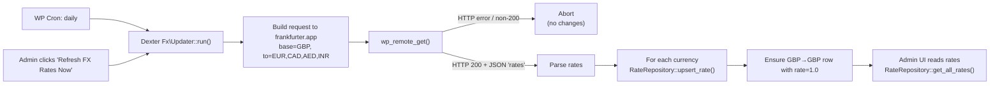
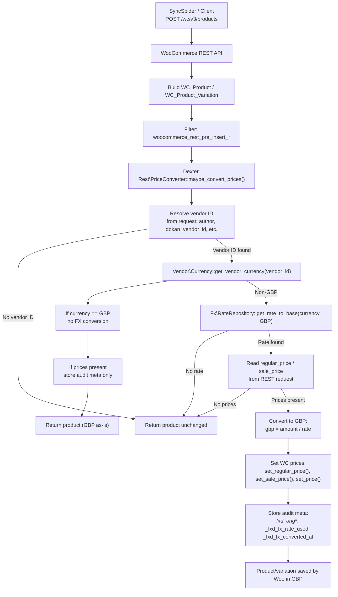

# Dexter Architecture

Dexter is a self-contained WordPress plugin that acts as the **FX layer** between:

- External integrations (e.g. SyncSpider → WooCommerce REST), and  
- The Fractured WooCommerce + Dokan marketplace (which remains GBP-only on the frontend).

It centralises:

- FX rate storage and updates  
- vendor base currency configuration  
- REST-time price conversion and audit logging  

so that vendors can work in their own currencies while Fractured stays consistent in GBP for customers, reporting, VAT and payouts.

## 1. High-level components

Dexter is structured into a few clear subsystems:

- **Infrastructure**
  - `Infrastructure/Activation.php`
  - Creates/updates the FX rates table on plugin activation.

- **FX subsystem**
  - `Fx/RateRepository.php`
    - Reads/writes FX rates in `wp_fxd_fx_rates`.
  - `Fx/Updater.php`
    - Fetches FX data from `frankfurter.app`.
    - Runs via daily cron + manual admin refresh.

- **Vendor subsystem**
  - `Vendor/Currency.php`
    - Adds a “Dexter – Vendor Currency” dropdown to Dokan vendors.
    - Stores `fxd_vendor_currency` user meta.

- **REST conversion subsystem**
  - `Rest/Hooks.php`
    - Registers WooCommerce REST hooks for products and variations.
  - `Rest/PriceConverter.php`
    - Resolves vendor, reads vendor currency, looks up FX rate, converts prices to GBP.
    - Stores FX audit metadata on products/variations.

- **Admin UI**
  - `Admin/Menu.php`
    - Adds the **Dexter FX** page in WP Admin.
    - Shows current FX rates and exposes a “Refresh FX Rates Now” button.

- **Core**
  - `Plugin.php`, `bootstrap.php`, `dexter.php`
    - Wire all subsystems together and expose a single plugin entrypoint.

## 2. Data model

### 2.1 FX rates table

Dexter uses a separate table:

- `wp_fxd_fx_rates` (prefix-aware)

Columns:

- `id` (bigint, PK)
- `base_currency` – 3-letter code (default: `GBP`)
- `currency` – 3-letter code (e.g. `EUR`, `CAD`)
- `rate` – decimal(18,8)
  - **Semantics:** “Units of `currency` per 1 unit of `base_currency`”
  - Example: `base=GBP`, `currency=EUR`, `rate=1.1379`  
    → `1 GBP = 1.1379 EUR`
- `last_updated` – datetime (UTC)
- `source` – e.g. `frankfurter.app`

Dexter uses this to compute:

```text
amount_in_gbp = amount_in_vendor_currency / rate
```
when converting vendor prices to GBP.

### 2.2 Vendor currency meta

Each Dokan vendor has a user meta:
	•	fxd_vendor_currency
	•	stored as uppercase ISO code (GBP, EUR, CAD, AED, INR)
	•	defaults to GBP if missing

This is the canonical source for “what currency does this vendor think in?”.

### 2.3 Product/variation audit metadata

On each REST insert/update where Dexter participates, it records:
- _fxd_orig_currency – vendor currency at the time of conversion
- _fxd_orig_regular_price – original numeric string from request
- _fxd_orig_sale_price – original sale price (if present)
- _fxd_fx_rate_used – FX rate from wp_fxd_fx_rates
- _fxd_fx_converted_at – UTC timestamp of conversion

WooCommerce’s normal price fields (_regular_price, _sale_price, _price) are always stored in GBP.

## 3. FX update flow

Dexter keeps its FX table up to date via:
- a daily WordPress cron event, and
- a manual “Refresh FX Rates Now” button.

### 3.1 FX flow diagram



**Key points:**
- Base currency is filterable via fractured_dexter_fx_base_currency (defaults to GBP).
- Target currencies are filterable via fractured_dexter_fx_target_currencies.
- Rates are only updated when a valid response with rates is received.
- FX calls happen off the main user path (cron or admin action), not on product pages.

## 4. REST price conversion flow

The core of Dexter is intercepting WooCommerce REST product insert/update and converting vendor prices to GBP.

### 4.1 REST hooks (where Dexter sits)

Dexter attaches to:
- woocommerce_rest_pre_insert_product_object
- woocommerce_rest_pre_insert_product_variation_object

These filters fire after WooCommerce has built a WC_Product/WC_Product_Variation object from the REST request, but before it is saved to the database.

### 4.2 Price conversion process



## 5. Vendor resolution details

Dexter tries to be robust and non-intrusive when deciding which vendor a product belongs to.

Order of checks:
1.	Request payload parameters (first match wins):
    - author
	- dokan_vendor_id
	- dokan_vendor
	- vendor_id
	- seller_id
2.	If none of the above are present:
	- Fetch the existing product (for updates) and use its post_author.

If still no vendor ID is found, **Dexter does nothing** for that request:
- prices are left unchanged
- no FX metadata is added

This ensures Dexter doesn’t break imports or non-vendor products.


## 6. Behaviour & safety guarantees

Dexter is designed to be safe and predictable:
- If:
	- vendor cannot be resolved, or
	- vendor currency is not set, or
	- FX rate is missing/invalid
        → **Dexter leaves prices untouched**.
- For GBP vendors:
	- No FX conversion is applied.
	- Audit metadata can still be recorded with:
	    - _fxd_orig_currency = GBP
	    - _fxd_fx_rate_used = 1.0
	- Price conversion only happens:
	    - at REST insert/update, not on frontend or cart/checkout.
	    - This keeps frontend performance and behaviour identical to a normal GBP store.
	- The FX updater:
	    - runs on cron or explicit admin action
	    - never runs on customer-facing requests.

## 7. SyncSpider integration pattern

External tools like SyncSpider only need to:
1.	Call the **standard WooCommerce REST endpoints** for products/variations.
2.	Send prices (regular_price / sale_price) in the **vendor’s native currency**.
3.	Send a vendor identifier in one of the fields Dexter checks:
	- e.g. author, dokan_vendor_id, vendor_id, etc.

Dexter then:
- Reads the vendor’s currency from fxd_vendor_currency.
- Converts the prices to GBP.
- Stores both GBP prices and original vendor prices + FX metadata.

No FX logic needs to live in SyncSpider.


## 8. Deployment & operations
- **Activation**
    - Creates/updates `wp_fxd_fx_rates` via `Infrastructure\Activation::activate()`.
- **Admin**
	- “Dexter FX” page:
	- Shows current FX rates.
	- Manual “Refresh FX Rates Now” button.
- **Cron**
	- Hook name: `fractured_dexter_fx_update`.
	- Scheduled daily via `Fx\Updater::schedule_cron()`.
- **Monitoring / debugging**
	- FX issues:
	    - Check Dexter FX page for rates and timestamps.
	    - Temporarily log responses in `Fx\Updater::fetch_rates_from_api()` if needed.
	- Conversion issues:
	    - Inspect product meta for `_fxd_*` fields.
	    - Verify vendor mapping in REST payload (matches a Dokan vendor user ID).
	    - Check `fxd_vendor_currency` on vendor profile.

## 9. Future enhancements (non-breaking ideas)

Potential evolutions that fit this architecture:
- CLI:
	- `wp dexter fx:update` – manual FX refresh from command line.
	- `wp dexter fx:list` – list current rates / detect missing ones.
- Debug UI:
	- “Last 20 conversions” panel with vendor, original price, GBP price, and rate.
- Per-vendor FX overrides:
	- Custom static rates for specific partner contracts.
- Extended currency set:
	- Allow more currencies via filters and by expanding target currencies list.
- Versioned FX:
	- Store historical FX snapshots per day if required for deeper financial analysis.

**Dexter’s current design already supports these with minimal changes.**